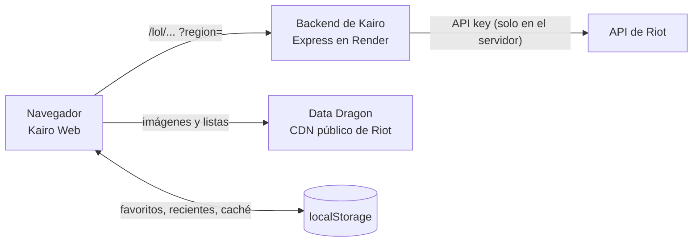

<div align="center">


# KAIRO WEB

**Cada partida cuenta.** Ahora también en el navegador.

Busca a cualquier jugador de **League of Legends** y mira su rango, su historial y su **partida en vivo**, estilo op.gg / porofessor.gg. Es la versión web de [Kairo](https://github.com/0scar07/Kairo).

[](https://github.com/0scar07/kairo-web/actions/workflows/deploy.yml)
[](https://github.com/0scar07/kairo-web/actions/workflows/ci.yml)


### [Abrir la web: 0scar07.github.io/kairo-web](https://0scar07.github.io/kairo-web/)

[Capturas](#capturas) · [Qué hace](#qué-hace) · [Correr en local](#correr-en-local) · [Despliegue](#despliegue) · [Arquitectura](#arquitectura) · [Hoja de ruta](#hoja-de-ruta)

<br />


</div>

---

## Capturas

<table>
  <tr>
    <td width="75%"></td>
    <td width="25%"></td>
  </tr>
  <tr>
    <td colspan="2"></td>
  </tr>
</table>

<sub>Capturas de la web corriendo contra el backend real de Kairo (Corea, octubre de 2026).</sub>

## Qué hace

**Header (en todas las páginas)**
- Logo animado de Kairo y selector de juego con los logos reales de los 9 juegos (LoL disponible; el resto, próximamente).
- Inicio, En vivo (con un contador de favoritos en partida), Favoritos, Clasificación y App.
- Buscador compacto, una campanita con los favoritos que están jugando ahora y el enlace a GitHub.

**Inicio**
- Arte animado alrededor del título: los campeones de la **rotación gratuita de la semana** flotan con destellos, siempre en movimiento.
- Tarjetas de los 9 juegos con inclinación 3D que sigue al mouse, reflejo y elevación.
- Buscador grande con región (LAN, LAS, NA, EUW, KR, BR) y `Nombre#TAG`. Autocompleta con tus favoritos y búsquedas recientes, con ícono, Riot ID y rango, y se maneja con el teclado (flechas, Enter, Esc).
- *Tus favoritos en partida*: qué favoritos están jugando ahora, con campeón, cola y cronómetro. Se revisa cada minuto.
- Clasificación Challenger real por región (LAN, LAS, NA, EUW, KR, BR) con Riot ID, LP y winrate, y búsquedas recientes.

**Perfil** · `/lol/:region/:Nombre-TAG`
- Cabecera con ícono, nivel y el splash del campeón más jugado de fondo. Botones Actualizar y Favorito.
- Pestañas de cola al estilo op.gg: Todo, Solo/Duo, Flex, ARAM (incluye ARAM: Caos) y Arena.
- Tarjetas de rango Solo/Dúo y flexible con el emblema y el color de la liga, victorias, derrotas, winrate y el *mejor nivel* de los últimos 30 días cuando supera al actual.
- **Partidas recientes**: dona de winrate, K/D/A medio, KDA, participación en kills, los 3 campeones más jugados con su récord y el rol preferido. Tiene búsqueda por campeón.
- Gráfico de LP de 30 días y campeones de las partidas cargadas.
- Historial con resultado, campeón, hechizos, runas, K/D/A, KDA, CS por minuto, participación, objetos y tiempo. El detalle muestra los 10 jugadores. Botón "Cargar más".
- Pestañas Campeones (tabla completa) y Maestría (top 10).

**Favoritos** · `/favoritos`
- Tus favoritos con ícono, región y rango; quién está jugando ahora (campeón, cola y cronómetro), acceso a su partida y botón para quitarlo.

**En vivo** · `/lol/:region/:Nombre-TAG/en-vivo`
- Cola, mapa y un cronómetro que avanza. Bloqueos de ambos equipos.
- Equipos azul y rojo con campeón, hechizos, runas, rango, LP, winrate y partidas, más el rango medio de cada equipo. El jugador buscado va resaltado.
- Si no está jugando, lo dice claro y vuelve a revisar solo.

**En todas las páginas**
- Los enlaces se comparten y cargan directo. Hay skeletons mientras carga y mensajes claros para "jugador no encontrado", el límite de la API y "Despertando el servidor…" cuando Render está dormido.
- Funciona en celular: las columnas se apilan y las tablas hacen scroll dentro de su caja.
- Animaciones sutiles (entrada escalonada, números que cuentan, logo que respira, barras de rol). Se apagan si el sistema pide `prefers-reduced-motion` y solo usan `transform` y `opacity`.
- Imágenes reales de Data Dragon (campeones, objetos, hechizos, runas e íconos) y emblemas oficiales de rango. Sin emojis.

TFT, Brawl Stars, Clash Royale, Clash of Clans, Dota 2, Fortnite, Apex Legends y PUBG aparecen como *Próximamente*: ya están en la [app](https://github.com/0scar07/Kairo).

## Correr en local

Requisitos: **Node 20 o más nuevo** (el despliegue usa Node 22, ver `.nvmrc`).

```bash
npm install
cp .env.example .env          # ajusta VITE_API_URL
npm run dev                   # http://localhost:5173/kairo-web/
```

| Contra qué backend | `VITE_API_URL` |
|---|---|
| Producción (Render) | `https://kairo-api-nqts.onrender.com` |
| Local (`server/` del repo de Kairo, con su `.env` y `RIOT_API_KEY`) | `http://localhost:3000` |

Para el backend local: `cd server && npm install && npm start` en el repo de Kairo. Si cambias `.env`, reinicia `npm run dev`.

### Scripts

| Comando | Qué hace |
|---|---|
| `npm run dev` | Servidor de desarrollo con recarga en caliente |
| `npm run build` | Build de producción en `dist/` (con `404.html` y `.nojekyll`) |
| `npm run preview` | Sirve el build en local |
| `npm run lint` | ESLint (reglas de React Hooks incluidas) |
| `npm test` | Pruebas con Vitest (32): caché del cliente, Riot ID en la URL, rangos, KDA, partidas, filtros de cola, roles y sugerencias |
| `npm run check` | Lint, pruebas y build: lo mismo que corre la CI |

## Despliegue

### GitHub Pages (el actual)

Cada push a `main` ejecuta [`deploy.yml`](.github/workflows/deploy.yml): `npm ci`, lint, pruebas, build con `VITE_API_URL` de producción y publicación de `dist/` con `actions/deploy-pages`. **Si el lint o las pruebas fallan, no se publica nada.** Los pull requests pasan por [`ci.yml`](.github/workflows/ci.yml).

- La web vive en `/kairo-web/`. Lo define `base` en `vite.config.js`; el `basename` de React Router y las rutas de `public/` salen de `import.meta.env.BASE_URL`.
- GitHub Pages no reescribe rutas, así que el build copia `index.html` a `404.html`: al abrir un link directo, Pages sirve esa copia y la SPA muestra la página pedida. Esas URLs responden con código 404, aunque se ven bien.

### Cloudflare Pages (alternativa)

Build `npm run build`, salida `dist` y las variables `VITE_API_URL` y **`BASE_PATH=/`** (para servir en la raíz del dominio). Las rutas SPA funcionan con `public/_redirects`, que GitHub Pages ignora.

En los dos casos, el dominio debe estar en `CORS_ORIGINS` del backend (o esa variable vacía, que acepta cualquier origen).

## Arquitectura



- **La web solo habla con el backend de Kairo.** Nunca llama a Riot y no tiene ninguna API key. La URL del backend se configura con `VITE_API_URL`.
- **Caché en el navegador** (`src/api/client.js`): la cuenta se guarda 10 min, invocador y rango 3, IDs de partidas 2, LP, maestría y clasificación 10. Las partidas terminadas se guardan 7 días, compactadas a unos 3 KB cada una (`compactMatch`). La partida en vivo, solo 20 s en memoria. *Actualizar* ignora la caché.
- **Servidor dormido**: si `/health` no contesta en unos segundos, aparece "Despertando el servidor…", se espera hasta 90 s y se reintenta la consulta.
- **Sin cuenta**: favoritos y recientes viven en el `localStorage` de cada navegador.

```
src/
  api/         client.js (fetch, caché, errores, servidor dormido) · server.js · lol.js (endpoints)
  lib/         ddragon.js · lol.js (colas, rangos, KDA, roles, compactMatch) · regions.js · library.js
               liveFavorites.js (favoritos en partida, compartido por header y portada) · gameLogos.js
               storage.js · hooks.js · games.js · config.js · *.test.js
  components/  Layout (header, selector de juego, campanita, footer) · SearchForm (autocompletado) · GameLogo
               CountUp · Icon · ui
  pages/       Home · Profile (+ profile/: RecentCard, Sidebar, MatchRow) · Live · Favorites · Misc
  styles/      tokens · global · components · home · profile · live
public/        logo, favicon, ranks/ (emblemas oficiales), games/ (logos de Supercell y Apex) y _redirects
docs/          capturas del README
```

### Backend

La web usa estos endpoints de `server/` del repo de Kairo:

| Endpoint | Para qué |
|---|---|
| `GET /lol/account/:nombre/:tag` | Riot ID → puuid |
| `GET /lol/summoner/:puuid` | Ícono y nivel |
| `GET /lol/ranked/:puuid` | Solo/Duo y Flex |
| `GET /lol/history/:puuid?days=30` | Gráfico de LP |
| `GET /lol/matches/:puuid?start&count&queue` | Historial (`queue` lo usan los filtros) |
| `GET /lol/match/:id` | Detalle de cada partida |
| `GET /lol/mastery/:puuid?count=10` | Pestaña Maestría |
| `GET /lol/live/:puuid` | Partida en vivo y favoritos en partida |
| `GET /lol/leaderboard?region&queue&limit` | Clasificación Challenger: `[{ puuid, gameName, tagLine, leaguePoints, wins, losses }]` |
| `GET /lol/rotation?region` | Rotación gratuita (arte del hero) |
| `GET /health` | Saber si el servidor está despierto |

El parámetro `queue` de `/lol/matches` **todavía no existe** en el backend: mientras tanto, los filtros de cola trabajan sobre las partidas ya cargadas, y cuando el backend lo agregue la web lo usa sola. Si el backend no tuviera `/lol/leaderboard` (por ejemplo, una versión vieja), la clasificación muestra "Disponible pronto" en vez de un error.

## Hoja de ruta

- [x] Clasificación Challenger real (endpoint `/lol/leaderboard`)
- [ ] Filtros de cola en el servidor (`?queue=` en `/lol/matches`)
- [ ] Comparar dos jugadores (ya existe en la app)
- [ ] Rango de temporadas pasadas (la API de Riot no lo ofrece: habría que guardarlo en el backend)
- [ ] TFT y los demás juegos de Kairo
- [ ] Más idiomas (la app tiene 5)

## Licencia

[MIT](LICENSE) © 2026 0scar07

---

<sub>Kairo no está respaldada por Riot Games, Supercell, Valve, Epic Games, Electronic Arts ni KRAFTON. Todas las marcas pertenecen a sus dueños.</sub>
