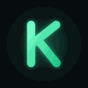
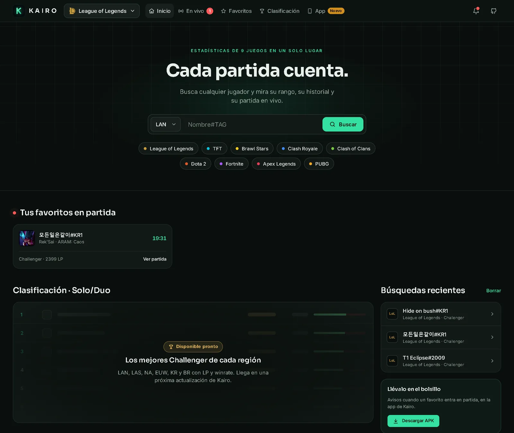
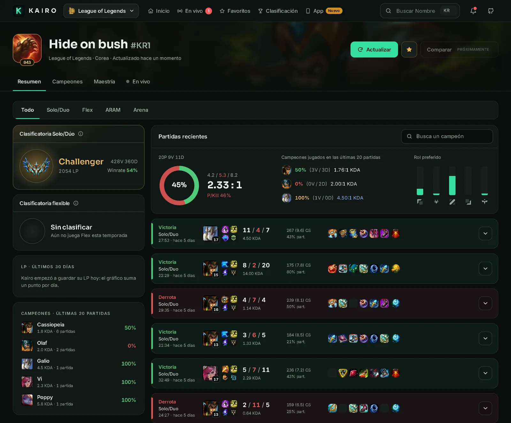
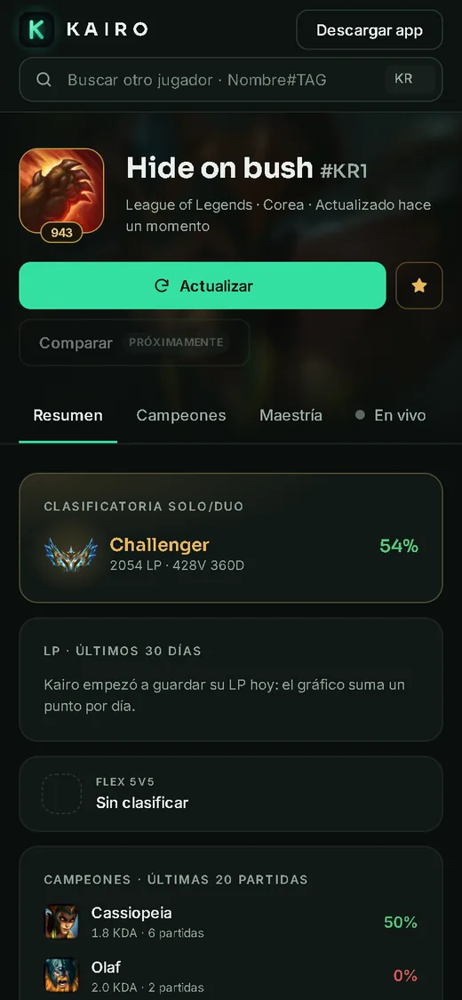
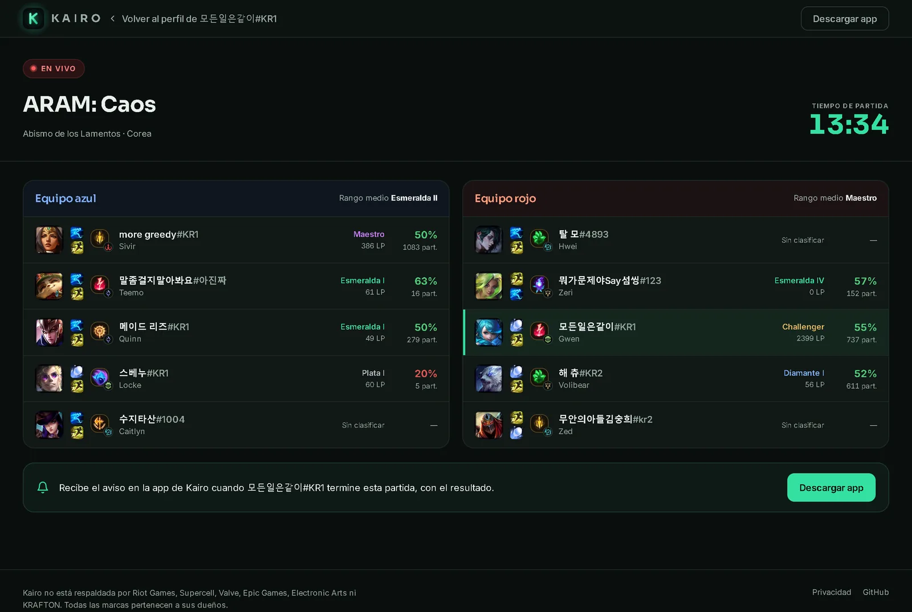
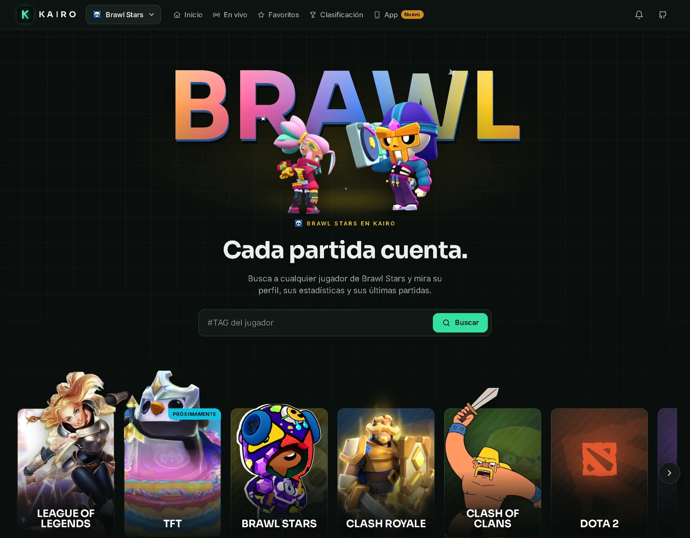
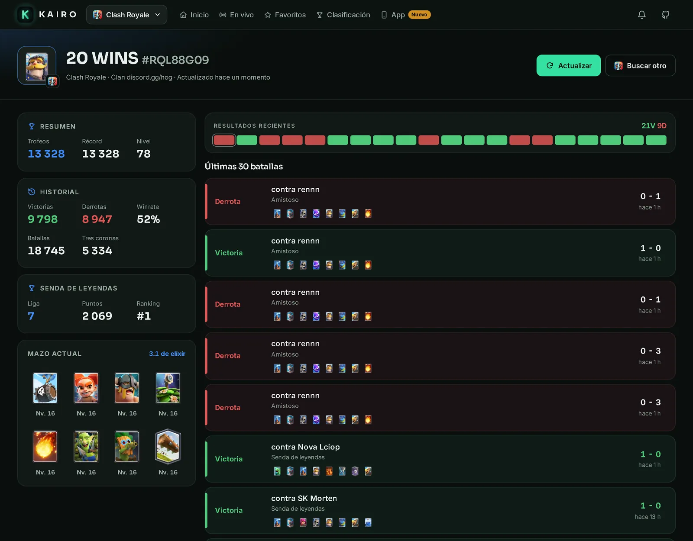
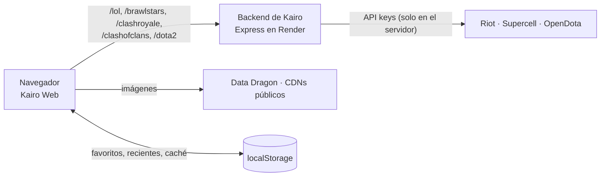

<div align="center">



# KAIRO WEB

**Cada partida cuenta.** Ahora también en el navegador.

Busca a cualquier jugador de **League of Legends**, **Brawl Stars**, **Clash Royale**, **Clash of Clans** o **Dota 2** y mira su rango, su historial y, en LoL, su **partida en vivo**. Es la versión web de [Kairo](https://github.com/0scar07/Kairo).

[](https://github.com/0scar07/kairo-web/actions/workflows/deploy.yml)
[](https://github.com/0scar07/kairo-web/actions/workflows/ci.yml)


### [Abrir la web: 0scar07.github.io/kairo-web](https://0scar07.github.io/kairo-web/)

[Capturas](#capturas) · [Juegos](#juegos) · [Qué hace](#qué-hace) · [Correr en local](#correr-en-local) · [Despliegue](#despliegue) · [Arquitectura](#arquitectura) · [Arte y permisos](#arte-y-permisos) · [Hoja de ruta](#hoja-de-ruta)

<br />



</div>

---

## Capturas

<table>
  <tr>
    <td width="75%"></td>
    <td width="25%"></td>
  </tr>
  <tr>
    <td colspan="2"></td>
  </tr>
  <tr>
    <td colspan="2"></td>
  </tr>
  <tr>
    <td colspan="2"></td>
  </tr>
</table>

<sub>Capturas de la web corriendo contra el backend real de Kairo (octubre de 2026).</sub>

## Juegos

| Juego | En la web | Búsqueda | Fuente de datos |
|---|---|---|---|
| League of Legends | Disponible | `Nombre#TAG` + región | API de Riot (vía el backend) |
| Brawl Stars | Disponible | `#TAG` | API oficial de Supercell |
| Clash Royale | Disponible | `#TAG` | API oficial de Supercell |
| Clash of Clans | Disponible | `#TAG` | API oficial de Supercell |
| Dota 2 | Disponible | Nombre de Steam o ID de cuenta | OpenDota |
| TFT | Próximamente | — | Riot todavía no habilita la API de TFT para la key de Kairo |
| Fortnite | Próximamente | — | Falta una key válida de Fortnite-API en el servidor |
| Apex Legends | Próximamente | — | Falta una key válida de Apex Legends Status en el servidor |
| PUBG | Próximamente | — | Falta configurar la key de PUBG en el servidor |

Los que aún no tienen búsqueda tienen su página con el motivo exacto y ya están en la [app](https://github.com/0scar07/Kairo).

## Qué hace

**Header (en todas las páginas)**
- Logo animado de Kairo y selector de juego con los logos reales de los 9 juegos, marcados como *Disponible* o *Próximamente*.
- Inicio, En vivo (con un contador de favoritos en partida), Favoritos, Clasificación y App.
- Buscador compacto, una campanita con los favoritos que están jugando ahora y el enlace a GitHub.

**Inicio** · `/`
- **Hero animado**: la palabra "KAIRO" en relieve 3D holográfico (efecto *foil*) con un degradado que corre y destellos, y una pareja de campeones de LoL (Zoe y Neeko) centrada delante, flotando y bailando.
- **Carrusel de pósters** de los 9 juegos. Lux (LoL), Pengu (TFT), Leon (Brawl Stars), el Caballero (Clash Royale) y el Bárbaro (Clash of Clans) sobresalen por encima de la tarjeta y respiran en reposo; al pasar el mouse la tarjeta sube, se inclina y el personaje crece más que el fondo. Dota 2, Fortnite, Apex y PUBG usan un fondo gráfico propio con su color y su logo. Se maneja con flechas, teclado y el dedo.
- Buscador grande con región (LAN, LAS, NA, EUW, KR, BR) y `Nombre#TAG`. Autocompleta con tus favoritos y búsquedas recientes, con ícono, Riot ID y rango, y se maneja con el teclado (flechas, Enter, Esc).
- *Tus favoritos en partida*: qué favoritos están jugando ahora, con campeón, cola y cronómetro. Se revisa cada minuto.
- Clasificación Challenger real por región con ícono, Riot ID, LP y winrate, y búsquedas recientes con el logo de su juego.

**Perfil de LoL** · `/lol/:region/:Nombre-TAG`
- Cabecera con ícono, nivel y el splash del campeón más jugado de fondo. Botones Actualizar y Favorito.
- Pestañas de cola: Todo, Solo/Duo, Flex, ARAM (incluye ARAM: Caos) y Arena.
- Tarjetas de rango Solo/Dúo y flexible con el emblema y el color de la liga, victorias, derrotas, winrate y el *mejor nivel* de los últimos 30 días cuando supera al actual.
- **Tu última partida**: el splash del campeón de fondo, resultado, K/D/A, CS por minuto, daño (y % del equipo), oro, visión, participación, objetos e insignias (Pentakill, Sin morir, Más daño del equipo, Primera sangre…).
- **Forma reciente**: anillo animado con el % de victorias, la racha actual con una llama (el panel brilla en verde o en rojo según la racha), un ecualizador con las últimas 20 partidas (victorias, derrotas y remakes en gris, con detalle al pasar el mouse), KDA medio, rol principal y campeón estrella.
- Gráfico de LP de 30 días, campeones de las partidas cargadas y búsqueda por campeón en el historial.
- Historial con resultado, campeón, hechizos, runas, K/D/A, KDA, CS por minuto, participación, objetos y tiempo. El detalle muestra los 10 jugadores. Botón "Cargar más".
- Pestañas Campeones (tabla completa) y Maestría (top 10).

**En vivo** · `/lol/:region/:Nombre-TAG/en-vivo`
- Cola, mapa y un cronómetro que avanza. Bloqueos de ambos equipos.
- Equipos azul y rojo con campeón, hechizos, runas, rango, LP, winrate y partidas, más el rango medio de cada equipo. El jugador buscado va resaltado.
- Si no está jugando, lo dice claro y vuelve a revisar solo.

**Favoritos** · `/favoritos`
- Tus favoritos con ícono, región y rango; quién está jugando ahora (campeón, cola y cronómetro), acceso a su partida y botón para quitarlo.
- **Avisos en el navegador** (Web Push): cuando un favorito de LoL entra en partida y cómo le fue, aunque la pestaña esté cerrada.
- **Sincronizar entre dispositivos** con un código de 12 caracteres, sin cuenta.

**Más de LoL**
- **Multi-búsqueda** (`/lol/multi`): pega el chat del lobby y ve a los 5 con rango, forma y campeones.
- **Comparar** (`/lol/comparar`), **Clasificación** completa (`/lol/clasificacion`), **página de partida** con oro minuto a minuto, **Récords** y mapa de actividad en el perfil, y **tarjeta para compartir como imagen**.
- **Campeones** (`/lol/campeones`): habilidades, aspectos, historia y la **build de los Challenger** (objetos, runas y hechizos más usados en Solo/Dúo Challenger de KR, EUW, NA y LAN).
- Etiquetas en la partida en vivo (OTP, Main, Primera vez…) y aviso cuando Riot tiene mantenimiento en la región.

**Página de cada juego** · `/juegos/:juego`
- Su propio hero con la palabra del juego y solo personajes de ese juego: Poro y Jinx chibi (TFT), Shelly y Poco (Brawl Stars), la Mosquetera y la Arquera (Clash Royale), el Mago y la Reina Arquera (Clash of Clans). Dota 2, Fortnite, Apex y PUBG muestran solo la palabra.
- El buscador del juego, el carrusel de pósters y, en los de Supercell, el **ranking mundial** (top 10 oficial).
- Lista de todos los juegos con su estado en `/juegos`.

**Perfil de otros juegos** · `/juegos/:juego/jugador/:id`
- **Brawl Stars**: trofeos, récord, nivel, victorias en 3 contra 3, solo y dúo, brawlers con poder, rango y trofeos, y las últimas batallas con brawler, modo y mapa.
- **Clash Royale**: trofeos, historial (victorias, derrotas, winrate, tres coronas), Senda de leyendas, mazo actual con el elixir medio y las últimas batallas con el mazo del rival.
- **Clash of Clans**: ayuntamiento, trofeos y récord, guerra y clan (estrellas, ataques y defensas ganadas, donaciones), clan con su escudo, héroes con su nivel y la base del constructor.
- **Dota 2**: búsqueda por nombre (con lista para elegir, porque los nombres se repiten) o por ID, medalla y rango, historial, héroes más jugados y partidas recientes.
- Todos con una tira de resultados recientes y botones Actualizar y Buscar otro.

**En todas las páginas**
- Los enlaces se comparten y cargan directo. Hay skeletons mientras carga y mensajes claros para "jugador no encontrado", el límite de la API y "Despertando el servidor…" cuando Render está dormido.
- Funciona en celular desde 390 px: las columnas se apilan y las tablas hacen scroll dentro de su caja, sin scroll horizontal en la página.
- Animaciones con `transform` y `opacity` (entrada escalonada, números que cuentan, logo que respira, hero, pósters, ecualizador). Se apagan si el sistema pide `prefers-reduced-motion`.
- Imágenes reales (Data Dragon, emblemas oficiales de rango, assets de Supercell, Steam y OpenDota) e íconos SVG propios. Sin emojis.

## Correr en local

Requisitos: **Node 20 o más nuevo** (el despliegue usa Node 22, ver `.nvmrc`).

```bash
npm install
cp .env.example .env          # ajusta VITE_API_URL
npm run dev                   # http://localhost:5173/kairo-web/
```

| Contra qué backend | `VITE_API_URL` |
|---|---|
| Producción (Render) | `https://kairo-api-nqts.onrender.com` |
| Local (`server/` del repo de Kairo, con su `.env`) | `http://localhost:3000` |

Para el backend local: `cd server && npm install && npm start` en el repo de Kairo. Si cambias `.env`, reinicia `npm run dev`.

### Scripts

| Comando | Qué hace |
|---|---|
| `npm run dev` | Servidor de desarrollo con recarga en caliente |
| `npm run build` | Build de producción en `dist/` (con `404.html` y `.nojekyll`) |
| `npm run preview` | Sirve el build en local |
| `npm run lint` | ESLint (reglas de React Hooks incluidas) |
| `npm test` | Pruebas con Vitest (35): caché del cliente, insignias y racha, Riot ID en la URL, rangos, KDA, partidas, filtros de cola, roles y sugerencias |
| `npm run check` | Lint, pruebas y build: lo mismo que corre la CI |

Los scripts de `scripts/` (Python, con `pillow` y `rembg`) regeneran el arte de los pósters y de los heroes; no hacen falta para correr la web.

## Despliegue

### GitHub Pages (el actual)

Cada push a `main` ejecuta [`deploy.yml`](.github/workflows/deploy.yml): `npm ci`, lint, pruebas, build con `VITE_API_URL` de producción y publicación de `dist/` con `actions/deploy-pages`. **Si el lint o las pruebas fallan, no se publica nada.** Los pull requests pasan por [`ci.yml`](.github/workflows/ci.yml).

- La web vive en `/kairo-web/`. Lo define `base` en `vite.config.js`; el `basename` de React Router y las rutas de `public/` salen de `import.meta.env.BASE_URL`.
- GitHub Pages no reescribe rutas, así que el build copia `index.html` a `404.html`: al abrir un link directo, Pages sirve esa copia y la SPA muestra la página pedida. Esas URLs responden con código 404, aunque se ven bien.

### Cloudflare Pages (alternativa)

Build `npm run build`, salida `dist` y las variables `VITE_API_URL` y **`BASE_PATH=/`** (para servir en la raíz del dominio). Las rutas SPA funcionan con `public/_redirects`, que GitHub Pages ignora.

En los dos casos, el dominio debe estar en `CORS_ORIGINS` del backend (o esa variable vacía, que acepta cualquier origen).

## Arquitectura



- **La web solo habla con el backend de Kairo.** Nunca llama a Riot, Supercell ni OpenDota directo y no tiene ninguna API key. La URL del backend se configura con `VITE_API_URL`.
- **Caché en el navegador** (`src/api/client.js`, en memoria y en `localStorage`): la cuenta de LoL se guarda 10 min, invocador y rango 3, IDs de partidas 2, LP, maestría y clasificación 10. Las partidas terminadas se guardan 7 días, compactadas a unos 3 KB cada una (`compactMatch`). La partida en vivo, solo 20 s en memoria. Los perfiles de Supercell 1 min, sus batallas 30 s y los rankings 10 min; Dota 2 2 min y su lista de héroes 1 día. *Actualizar* ignora la caché, y las respuestas incompletas no se guardan.
- **Servidor dormido**: si `/health` no contesta en unos segundos, aparece "Despertando el servidor…", se espera hasta 90 s y se reintenta la consulta.
- **Sin cuenta**: favoritos y recientes viven en el `localStorage` de cada navegador.
- **Un registro por juego** (`src/games/registry.js`): cómo se reconoce una búsqueda, cómo se carga un jugador y qué muestra la cabecera. Agregar un juego es sumar una entrada ahí y su cuerpo de perfil.

```
src/
  api/         client.js (fetch, caché, errores, servidor dormido) · server.js · lol.js (endpoints de LoL)
  games/       registry.js (juegos con perfil) · supercell.js + SupercellProfiles.jsx · dota2.js + Dota2Profile.jsx
               ui.jsx (tarjetas, tira de resultados y filas de batalla compartidas)
  lib/         ddragon.js · lol.js (colas, rangos, KDA, roles, racha, compactMatch) · regions.js · library.js
               games.js (los 9 juegos y su estado) · heroes.js (hero de cada juego) · liveFavorites.js
               gameLogos.js · storage.js · hooks.js · config.js · *.test.js
  components/  Layout (header, selector de juego, campanita, footer) · SearchForm (autocompletado) · GameLogo
               CountUp · Icon · RoleIcon · ui
  pages/       Home (+ home/: HeroShowcase, GameCards, posterArt) · Profile (+ profile/: LastMatchCard, Sidebar,
               MatchRow, useProfile) · Live · Favorites · GamePage · GameProfile · Misc
  styles/      tokens · global · components · home · profile · live · games
public/        logo, favicon, ranks/ (emblemas oficiales), games/ (logos y pósters), hero/ (personajes por juego)
scripts/       poster-art.py · poster-cutouts.py · hero-art.py
docs/          capturas del README
```

### Backend

La web usa estos endpoints de `server/` del repo de Kairo:

| Endpoint | Para qué |
|---|---|
| `GET /lol/account/:nombre/:tag` | Riot ID → puuid |
| `GET /lol/summoner/:puuid` | Ícono y nivel |
| `GET /lol/ranked/:puuid` | Solo/Duo y Flex |
| `GET /lol/history/:puuid?days=30` | Gráfico de LP |
| `GET /lol/matches/:puuid?start&count&queue` | Historial (`queue` lo usan los filtros) |
| `GET /lol/match/:id` | Detalle de cada partida |
| `GET /lol/mastery/:puuid?count=10` | Pestaña Maestría |
| `GET /lol/live/:puuid` | Partida en vivo y favoritos en partida |
| `GET /lol/leaderboard?region&queue&limit` | Clasificación Challenger: `[{ puuid, gameName, tagLine, leaguePoints, wins, losses }]` |
| `GET /:juego/player/:tag` | Perfil de Brawl Stars, Clash Royale o Clash of Clans |
| `GET /:juego/battles/:tag` | Últimas batallas (Brawl Stars y Clash Royale) |
| `GET /:juego/top?limit` | Ranking mundial de cada juego de Supercell |
| `GET /dota2/search?q` | Buscar jugadores de Dota 2 por nombre |
| `GET /dota2/player/:id` | Perfil, medalla, héroes y partidas de Dota 2 |
| `GET /dota2/heroes` | Nombres e imágenes de los héroes |
| `GET /lol/live/:puuid/insights` | Etiquetas de la partida en vivo (maestría de los 10) |
| `GET /lol/match/:id/timeline` | Oro minuto a minuto y objetivos |
| `GET /lol/builds` · `/lol/builds/:championId` | Meta y build de los Challenger |
| `GET /lol/status` | Mantenimientos e incidencias de Riot |
| `GET /:juego/club/:tag` · `/brawlstars/brawlers` · `/brawlstars/events` | Clubes y clanes, brawlers y eventos |
| `GET /dota2/match/:id` · `/dota2/items` · `/dota2/herostats` | Partida, objetos y héroes de Dota 2 |
| `POST /devices` (platform `web`) · `GET /devices/webpush-key` | Avisos en el navegador |
| `POST /sync` · `GET`/`PUT /sync/:code` | Favoritos sincronizados |
| `GET /health` | Saber si el servidor está despierto |

El parámetro `queue` de `/lol/matches` **todavía no existe** en el backend: mientras tanto, los filtros de cola trabajan sobre las partidas ya cargadas, y cuando el backend lo agregue la web lo usa sola. Si el backend no tuviera `/lol/leaderboard` (por ejemplo, una versión vieja), la clasificación muestra "Disponible pronto" en vez de un error.

## Arte y permisos

Solo se usa arte con permiso explícito para proyectos de fans. Las fuentes están documentadas en `src/pages/home/posterArt.js` y en cada script de `scripts/`.

| Juego | Fuente | Nota |
|---|---|---|
| League of Legends y TFT | Data Dragon de Riot | Política «Legal Jibber Jabber» de Riot Games |
| Brawl Stars, Clash Royale y Clash of Clans | [Fan Kit oficial de Supercell](https://fankit.supercell.com/) (personajes) y el CDN de Brawlify (íconos de brawlers, porque la API no trae imágenes) | Fan Content Policy de Supercell |
| Dota 2 | CDN de Steam (héroes y avatares) y medallas de OpenDota | Las mismas que usa la app |
| Fortnite, Apex Legends y PUBG | Sin arte por ahora: fondo gráfico propio con su color y su logo | — |

Los recortes de personajes se hacen con [rembg](https://github.com/danielgatis/rembg) (modelo `isnet-general-use`) y se guardan en WebP. Los avisos legales que piden Riot y Supercell están en el footer.

## Hoja de ruta

- [x] Clasificación Challenger real (endpoint `/lol/leaderboard`)
- [x] Brawl Stars, Clash Royale y Clash of Clans con perfil, batallas y ranking mundial
- [x] Dota 2 con búsqueda por nombre o ID
- [x] Hero propio para cada juego
- [x] Multi-búsqueda, Comparar, partida, récords, builds de Challenger, avisos en el navegador y favoritos sincronizados
- [ ] TFT (cuando Riot habilite la API para la key de Kairo)
- [ ] Fortnite, Apex Legends y PUBG (cuando el servidor tenga keys válidas)
- [ ] Filtros de cola en el servidor (`?queue=` en `/lol/matches`)
- [ ] Comparar dos jugadores (ya existe en la app)
- [ ] Rango de temporadas pasadas (la API de Riot no lo ofrece: habría que guardarlo en el backend)
- [ ] Más idiomas (la app tiene 5)
- [ ] Vista previa de enlaces de cada jugador (hoy la tienen los campeones, los juegos y las páginas fijas)

## Licencia

[MIT](LICENSE) © 2026 0scar07

---

<sub>Kairo no está respaldada por Riot Games, Supercell, Valve, Epic Games, Electronic Arts ni KRAFTON. Todas las marcas pertenecen a sus dueños.</sub>
